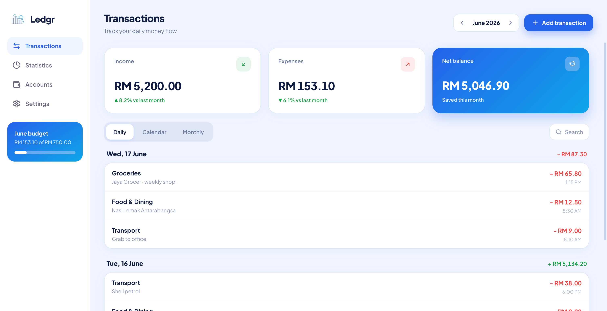
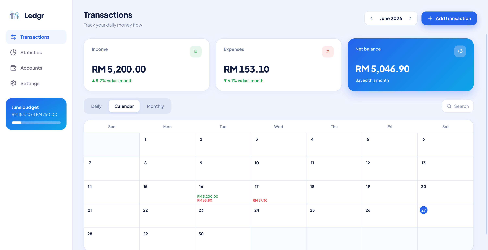
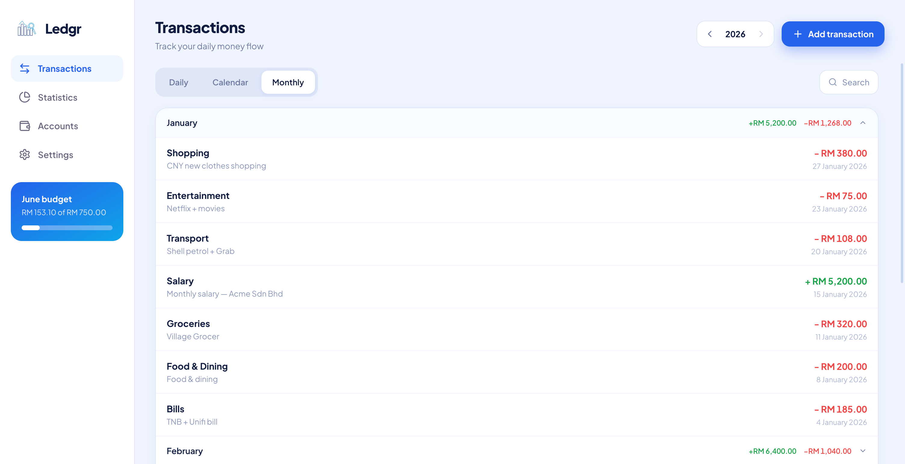
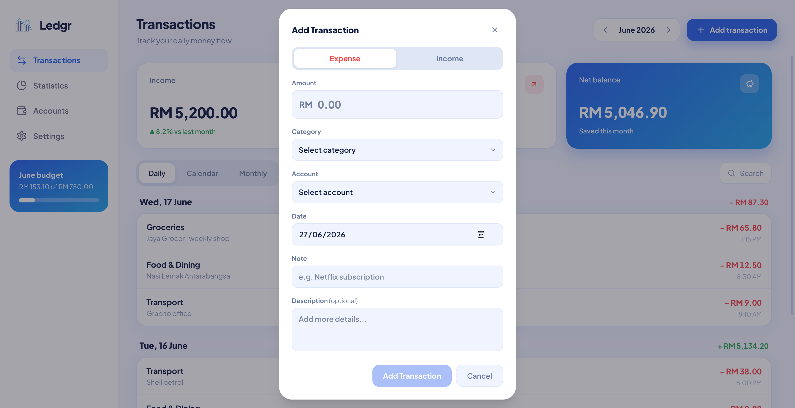
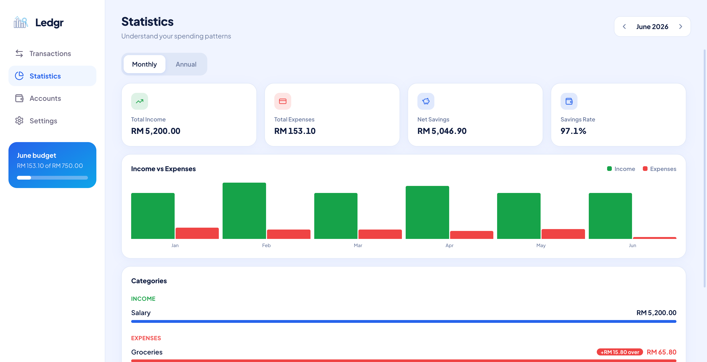
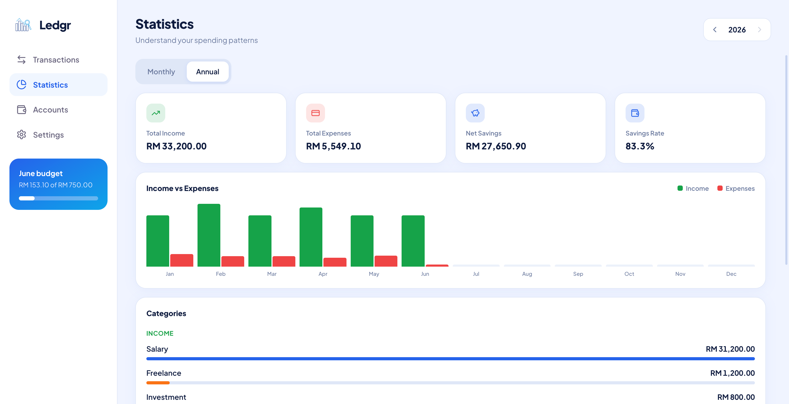
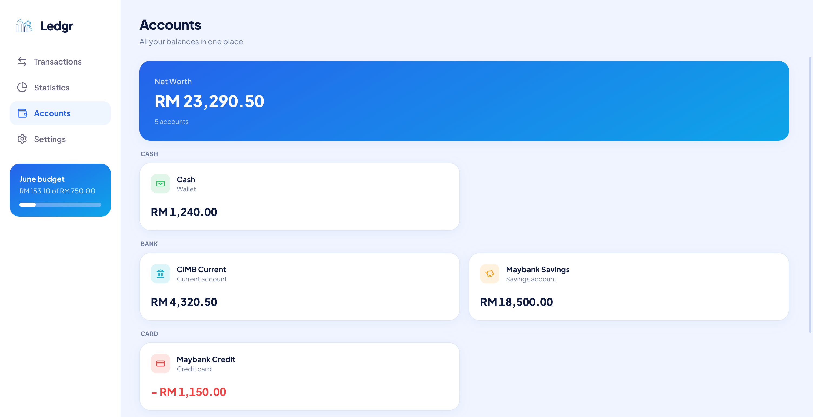
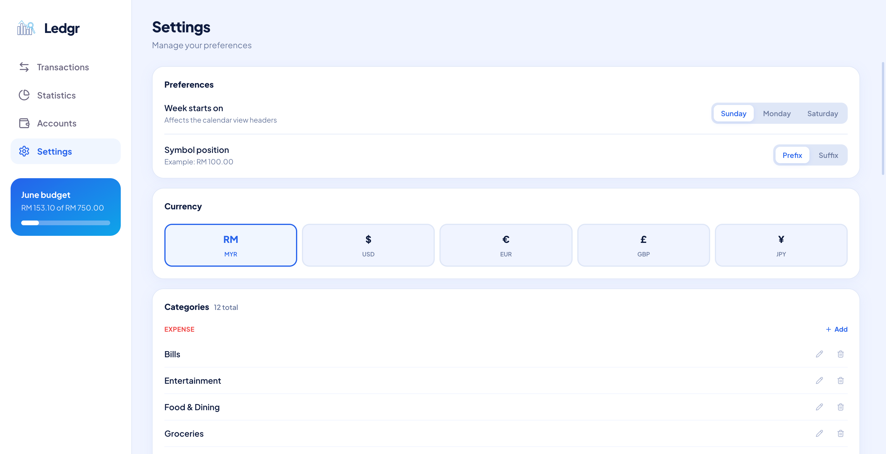
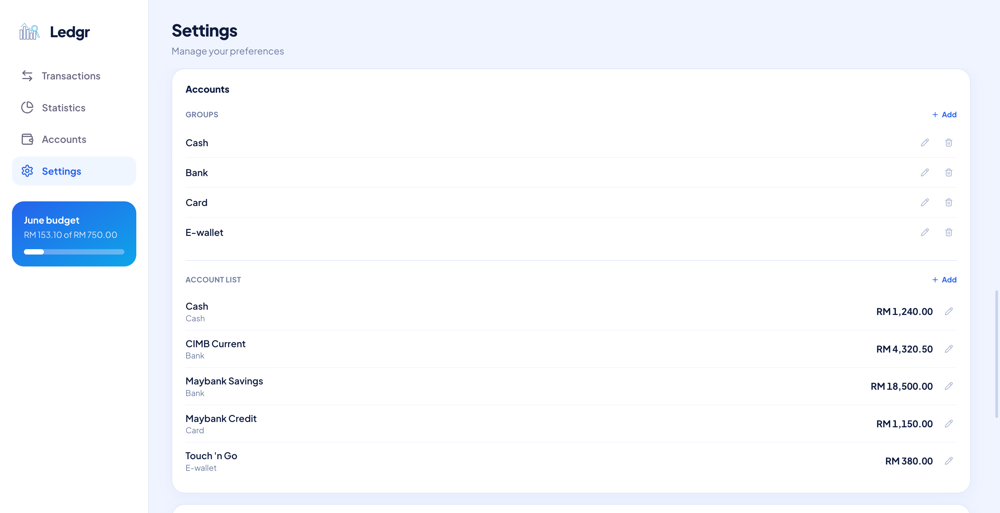
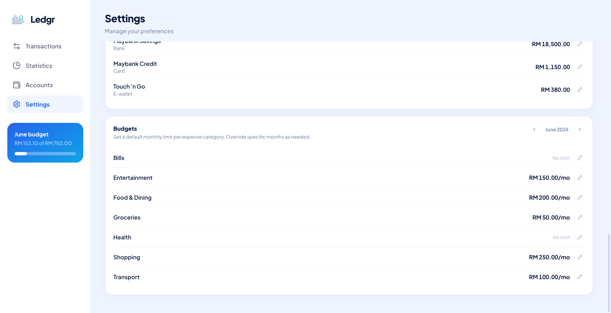

# Ledgr

A personal finance tracker for monitoring income, expenses, budgets, and account balances. Built as a full-stack monorepo with a React frontend and an Express REST API backed by MySQL.

---

## Table of Contents

- [Features](#features)
- [Screenshots](#screenshots)
- [Tech Stack](#tech-stack)
- [Project Structure](#project-structure)
- [Prerequisites](#prerequisites)
- [Getting Started](#getting-started)
- [Available Scripts](#available-scripts)
- [Environment Variables](#environment-variables)
- [Database](#database)
- [API Overview](#api-overview)

---

## Features

- **Transaction management** — add, edit, and delete transactions with daily, calendar, and monthly views
- **Global search** — search all transactions across all time with filters for type, category, and amount range
- **Statistics** — monthly and annual income/expense charts with interactive hover to show amounts; category breakdown split into income and expenses showing all categories
- **Budget tracking** — set default monthly limits per category with per-month overrides; over-budget categories highlighted with a red bar, red amount, and surplus pill in the stats breakdown
- **Account management** — track balances across multiple accounts grouped by type
- **Settings** — configurable currency, symbol position, week start day, categories, and budgets
- **Responsive design** — full mobile support with bottom navigation and bottom-sheet modals

---

## Screenshots

| Transactions - Daily View                                | Transactions - Calendar View                                |
| -------------------------------------------------------- | ----------------------------------------------------------- |
|  |  |

| Transactions - Monthly View                                | Add Transactions Modal                                 |
| ---------------------------------------------------------- | ------------------------------------------------------ |
|  |  |

| Statistics - Monthly                            | Statistics - Annual                              |
| ----------------------------------------------- | ------------------------------------------------ |
|  |  |

| Accounts                                   | Settings - Preferences, Currency, Categories |
| ------------------------------------------ | -------------------------------------------- |
|  |   |

| Settings - Accounts                         | Settings - Budgets                          |
| ------------------------------------------- | ------------------------------------------- |
|  |  |

---

## Tech Stack

| Layer    | Technology                                  |
| -------- | ------------------------------------------- |
| Frontend | React 19, TypeScript, Vite, Tailwind CSS v4 |
| State    | TanStack React Query v5                     |
| Icons    | Lucide React                                |
| Backend  | Node.js, Express 5, TypeScript              |
| Database | MySQL 8.4                                   |
| Infra    | Docker Compose                              |

---

## Project Structure

```
ledgr/
├── client/                  # React frontend (Vite)
│   └── src/
│       ├── components/
│       │   ├── settings/    # Settings sub-components (Preferences, Currency, Categories, Accounts, Budgets)
│       │   ├── stats/       # Chart and category breakdown components
│       │   ├── transactions/# Transaction views (Daily, Calendar, Monthly, Search, Add)
│       │   └── ui/          # Shared UI primitives (SettingCard)
│       ├── hooks/           # Custom React hooks (useSettings, useMonth)
│       ├── lib/             # API client, utilities, constants
│       ├── pages/           # Page-level components (Transactions, Stats, Accounts, Settings)
│       └── types/           # Shared TypeScript interfaces
├── server/                  # Express REST API
│   └── src/
│       ├── controllers/     # Route handler logic
│       ├── db/              # MySQL connection and schema
│       ├── middleware/      # Request validation (Zod)
│       └── routes/          # Express route definitions
├── docker-compose.yml       # MySQL service
└── package.json             # Workspace root
```

---

## Prerequisites

- [Node.js](https://nodejs.org/) v18 or later
- [Docker](https://www.docker.com/) (for the MySQL database)
- npm v8 or later (workspaces support)

---

## Getting Started

### 1. Clone the repository

```bash
git clone <repository-url>
cd ledgr
```

### 2. Install dependencies

```bash
npm install
```

### 3. Start the database

```bash
docker compose up -d
```

The MySQL container initialises on first start using `server/src/db/schema.sql`, which creates all tables and seeds default data automatically.

### 4. Start the development servers

```bash
npm run dev
```

This starts both the client (port **5173**) and server (port **3000**) concurrently.

Open [http://localhost:5173](http://localhost:5173) in your browser.

---

## Available Scripts

Run from the project root:

| Command             | Description                                       |
| ------------------- | ------------------------------------------------- |
| `npm run dev`       | Start client and server in development mode       |
| `npm run build`     | Build both client and server for production       |
| `npm run lint`      | Lint both workspaces                              |
| `npm run typecheck` | Run TypeScript type checks across both workspaces |

---

## Environment Variables

The server reads the following variables. Create a `.env` file inside `server/` if overriding the defaults.

| Variable  | Default          | Description         |
| --------- | ---------------- | ------------------- |
| `PORT`    | `3000`           | Express server port |
| `DB_HOST` | `127.0.0.1`      | MySQL host          |
| `DB_PORT` | `3306`           | MySQL port          |
| `DB_NAME` | `ledgr`          | Database name       |
| `DB_USER` | `ledgr`          | Database user       |
| `DB_PASS` | `ledgr_password` | Database password   |

---

## Database

The database schema is defined in [`server/src/db/schema.sql`](server/src/db/schema.sql) and is applied automatically when the Docker container is first created.

To reset the database and re-apply the schema:

```bash
docker compose down -v   # removes the volume (all data)
docker compose up -d     # re-creates with fresh schema and seed data
```

---

## API Overview

All endpoints are prefixed with `/api`.

| Method | Path                                             | Description                           |
| ------ | ------------------------------------------------ | ------------------------------------- |
| GET    | `/api/transactions`                              | List transactions (year/month filter) |
| POST   | `/api/transactions`                              | Create a transaction                  |
| PATCH  | `/api/transactions/:id`                          | Update a transaction                  |
| DELETE | `/api/transactions/:id`                          | Delete a transaction                  |
| GET    | `/api/categories`                                | List all categories                   |
| POST   | `/api/categories`                                | Create a category                     |
| PATCH  | `/api/categories/:id`                            | Update a category                     |
| DELETE | `/api/categories/:id`                            | Delete a category                     |
| GET    | `/api/accounts`                                  | List all accounts                     |
| POST   | `/api/accounts`                                  | Create an account                     |
| PATCH  | `/api/accounts/:id`                              | Update an account                     |
| DELETE | `/api/accounts/:id`                              | Delete an account                     |
| GET    | `/api/account-groups`                            | List account groups                   |
| POST   | `/api/account-groups`                            | Create an account group               |
| PATCH  | `/api/account-groups/:id`                        | Update an account group               |
| DELETE | `/api/account-groups/:id`                        | Delete an account group               |
| GET    | `/api/budgets`                                   | Get budgets for a month               |
| PUT    | `/api/budgets/:categoryId/default`               | Set or update a default budget        |
| PUT    | `/api/budgets/:categoryId/override/:year/:month` | Set a month-specific override         |
| DELETE | `/api/budgets/:categoryId/override/:year/:month` | Remove a budget override              |
| DELETE | `/api/budgets/:categoryId`                       | Remove all budgets for a category     |
| GET    | `/api/stats/monthly`                             | Monthly income/expense summaries      |
| GET    | `/api/stats/categories`                          | Category breakdown for a period       |
| GET    | `/api/settings`                                  | Get user settings                     |
| PATCH  | `/api/settings`                                  | Update user settings                  |
